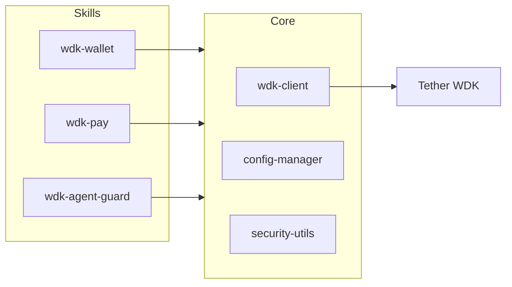

# WaltWDK — Architecture

## Overview

Monorepo with npm workspaces: shared **core** plus three independent skills publishable to ClawHub.

## Components

| Component | Role |
|-----------|------|
| **src/core/wdk-client.ts** | Wrapper around `@tetherto/wdk`; registers EVM + TRON wallets; exposes getAccount, getBalance, sendTransaction, transfer. |
| **src/core/config-manager.ts** | Load/save `~/.walt-wdk/config.json`; default network, default wallet, guard config. |
| **src/core/security-utils.ts** | AES-256-GCM encrypt/decrypt; address validation (EVM, TRON); encryption password from env. |

## Data flow

1. User or agent invokes a skill (e.g. wdk-wallet create, wdk-pay send).
2. Skill uses **core**: WdkClient (with seed from store), loadConfig, getConfigDir, encrypt/decrypt.
3. **wdk-wallet** writes wallets to `~/.walt-wdk/wallets.json` + `secrets/wdk-wallet.{name}.key` (encrypted seed).
4. **wdk-pay** reads the same store to resolve wallet by name; sends via WdkClient; appends to `pay-ledger.jsonl` for history.
5. **wdk-agent-guard** reads guard config from core; checks blacklist → whitelist → per-tx limit → daily limit → requireApproval; writes `guard-ledger.json` (daily spent) and `guard-audit.jsonl` (decisions).

## Integration (wdk-pay + wdk-agent-guard)

Before sending, the agent can call **wdk-agent-guard** `checkLimit()`. If `allowed` is false, abort. If `requiresApproval` is true, call `requestApproval()` and only proceed if approved. After a successful send, call `recordSpend(amount, currency)` to update the daily ledger.

## License

Apache-2.0
